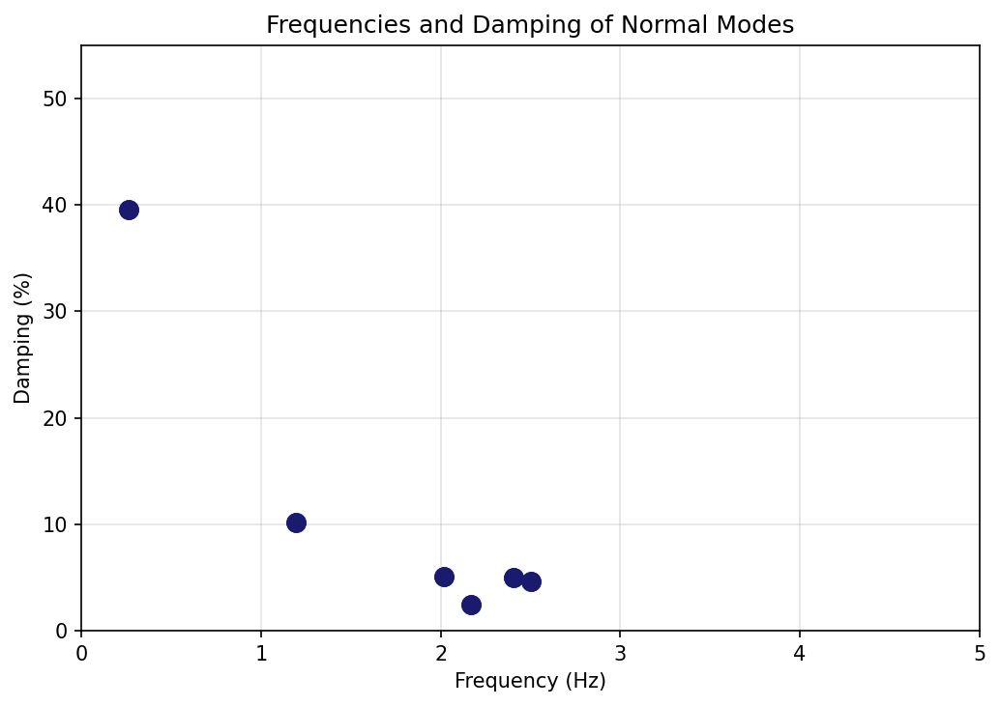
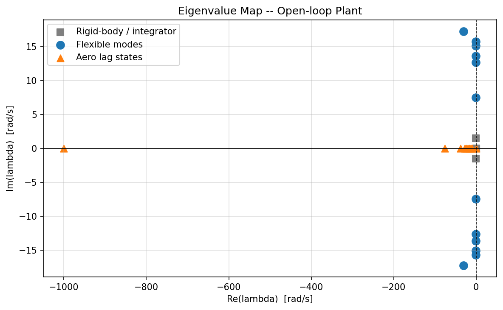
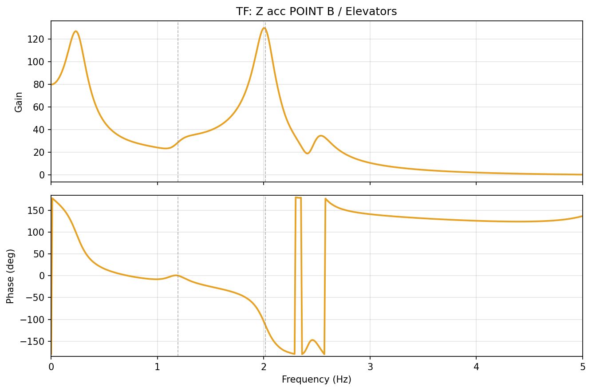
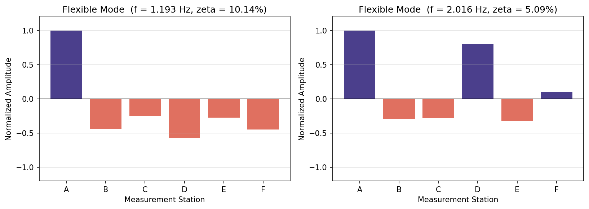
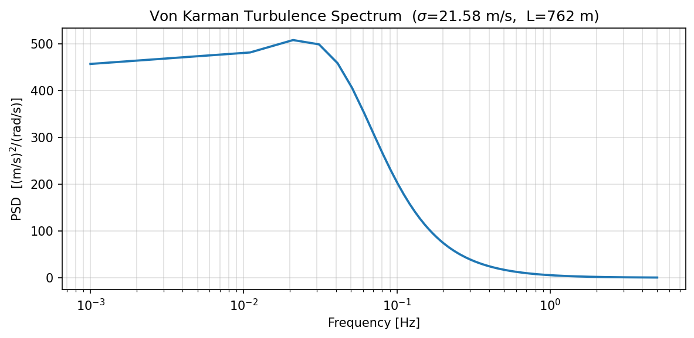
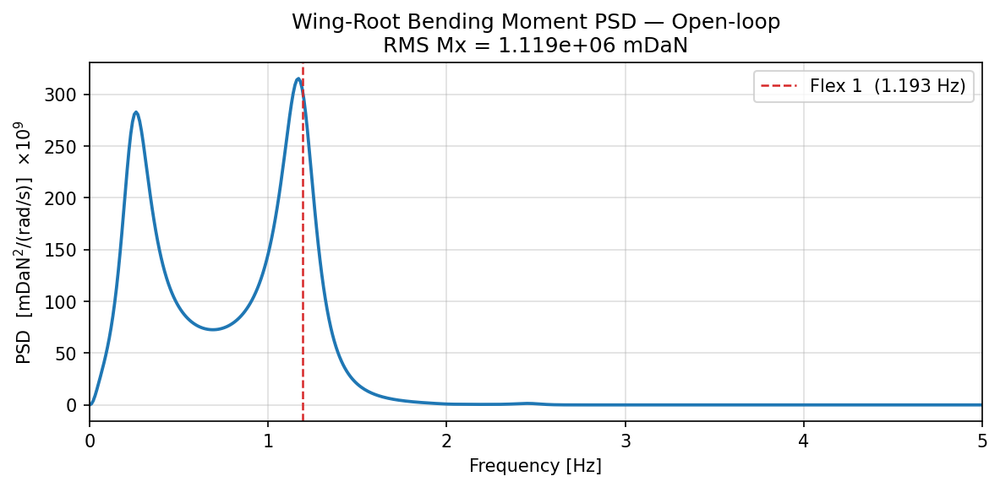
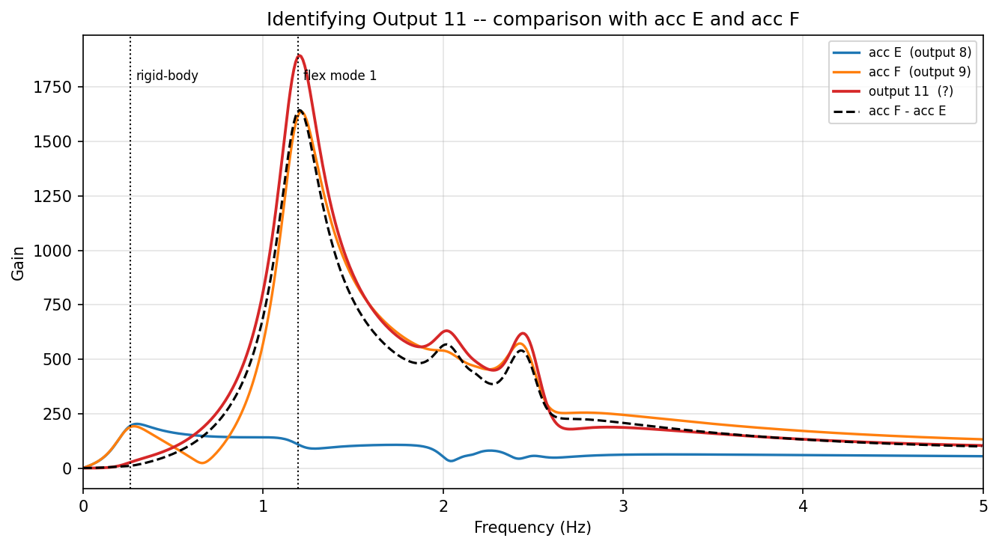
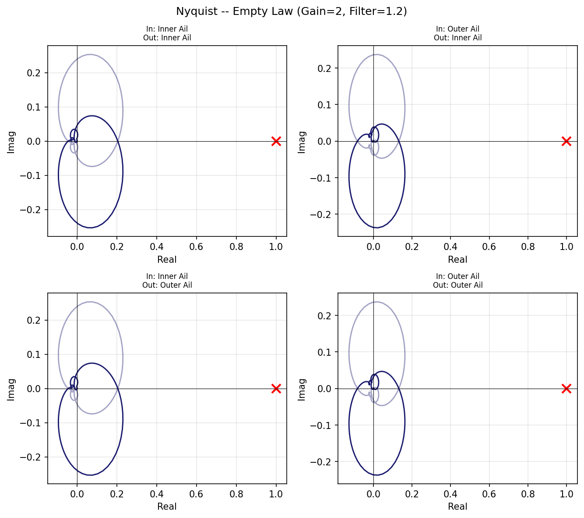
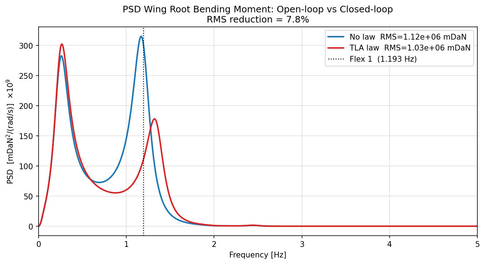

# Turbulence Response and Active Load Alleviation of a Flexible Aircraft

**ISAE-SUPAERO** | Master in Aerospace Engineering — Aeroelasticity & Flight Mechanics  
**Author:** Phani Raghava PANCHAGNULA

---

## 1. Project Description

This work covers the structural dynamics and load analysis of a large flexible aircraft
(A340-class) flying through atmospheric turbulence, and the design of an active control
law to reduce wing loads.

The aircraft is modelled as a linear state-space system at a cruise flight point
(Mach 0.8, altitude 25 000 ft). The analysis is split into three parts: modal analysis
of the structural model, turbulence response using Power Spectral Density (PSD) methods,
and design of a Torsion Load Alleviation (TLA) control law.

All code is written in Python (numpy, scipy, matplotlib) and developed in a Jupyter
notebook. The original MATLAB scripts from the course are kept as reference only.

---

## 2. Aircraft Model and Instrumentation

The figure below shows the aircraft geometry, measurement station locations, and
control surfaces used in the model.


The aircraft has three active control surfaces: inner ailerons (orange), outer ailerons
(blue), and elevators (green). Measurement stations are distributed along the fuselage
(A, B, C, D, G) and on the wing (E, F). The wind incidence angle i\_wind is the angle
between the airspeed vector VTAS and the total relative wind, which includes the
vertical gust component.

### 2.1 State-Space Representation

The dynamics are written in standard continuous-time form:

```
Time domain:
    dx/dt  =  A x(t)  +  B u(t)
    y(t)   =  C x(t)  +  D u(t)
```

| Matrix | Size    | Description |
|--------|---------|-------------|
| A      | 26 x 26 | System dynamics — structural modes and aerodynamic lag states |
| B      | 26 x 4  | How each input drives the states |
| C      | 11 x 26 | Maps states to measured outputs |
| D      | 11 x 4  | Direct feed-through (non-zero for some outputs) |

The 26 states include: rigid-body degrees of freedom (heave, pitch), flexible structural
modes (generalised coordinates), and aerodynamic lag states from Roger's method
(rational function approximation of unsteady aerodynamics).

**Flight point:**

| Parameter | Value | Units |
|-----------|-------|-------|
| Mach number | 0.8 | — |
| Altitude | 25 000 | ft |
| True airspeed (VTAS) | 247.6 | m/s |

### 2.2 Inputs

There are four inputs to the model:

| # | Name | Units | Description |
|---|------|-------|-------------|
| 1 | Inner Ailerons | rad | Symmetric deflection of inner ailerons |
| 2 | Outer Ailerons | rad | Symmetric deflection of outer ailerons |
| 3 | Elevators | rad | Elevator deflection |
| 4 | Wind Incidence | rad | Vertical gust as incidence angle: i\_wind = w\_gust / VTAS |

**Note on input 4:** The wind input is not the gust velocity directly, it is the
incidence angle (radians). When computing the output PSD from the Von Karman spectrum
(which gives gust velocity variance), the transfer function column for wind must be
divided by VTAS to account for this normalisation.

### 2.3 Outputs

There are eleven outputs:

| # | Name | Units | Location | Notes |
|---|------|-------|----------|-------|
| 1 | Z acc POINT A | m/s^2 | Fuselage front | Near cockpit |
| 2 | Z acc POINT B | m/s^2 | Fuselage mid-rear | |
| 3 | Z acc POINT C | m/s^2 | Fuselage centre | Near wing root |
| 4 | Z acc POINT D | m/s^2 | Fuselage rear | Near tail |
| 5 | Pitch Rate | rad/s | CG (G) | |
| 6 | Z Speed | m/s | CG (G) | Vertical velocity |
| 7 | Pitch Angle | rad | CG (G) | |
| 8 | Z acc POINT E | m/s^2 | Wing inner | |
| 9 | Z acc POINT F | m/s^2 | Wing tip | |
| 10 | Mx Wing Root | mDaN | Wing root | Primary load metric |
| 11 | Differential acc | m/s^2 | Wing | acc\_F − acc\_E (identified below) |

Output 10, the wing-root bending moment Mx, is the structural load we are trying to
reduce. Output 11 is used as the TLA sensor and its physical meaning is identified
in Part 3.

---

## 3. Part 1 — Modal Analysis

### 3.1 Method

The natural frequencies and damping ratios are extracted from the eigenvalues of A:

```
lambda = eig(A)
omega_n = |lambda|
zeta    = -Re(lambda) / omega_n   (as a fraction, multiply by 100 for percent)
f       = omega_n / (2*pi)
```

### 3.2 Mode Classification

The 26 eigenvalues split into three groups based on frequency and damping:

- **Rigid-body modes** (f < 0.5 Hz): the short-period and phugoid modes of the aircraft
  as a rigid body. These have relatively high damping because they are controlled by
  aerodynamics.
- **Flexible modes** (f = 1–5 Hz, zeta < 15%): structural bending and torsion modes of
  the wing and fuselage. These are lightly damped and responsible for the structural
  fatigue under turbulence.
- **Aerodynamic lag states** (zeta = 100%): real, stable poles introduced by Roger's
  method to approximate the frequency-dependence of aerodynamic forces. They are not
  physical structural modes.



The scatter plot above excludes the aero lag states (zeta = 100%) to focus on the
physically meaningful modes. The rigid-body short-period mode (0.26 Hz, 39.5% damping)
and the first five flexible modes are visible.

### 3.3 Identified Modes

| Mode | Frequency (Hz) | Damping (%) | Type |
|------|---------------|-------------|------|
| Short period | 0.262 | 39.5 | Rigid-body |
| Flexible 1 | 1.193 | 10.1 | Wing first bending |
| Flexible 2 | 2.016 | 5.1 | Wing second bending |
| Flexible 3 | 2.170 | 2.4 | Torsion / coupling |
| Flexible 4 | 2.405 | 5.0 | |
| Flexible 5 | 2.502 | 4.6 | |

The aero lag poles (real, negative) appear at 1.58, 1.69, 2.36, 2.76, 3.15, 3.94, 4.29 Hz.



The eigenvalue map shows all 26 poles in the complex plane. Flexible modes appear as
conjugate pairs symmetrically placed about the real axis; lag states sit on the
negative real axis.

### 3.4 Transfer Functions and Bode Plot

To compute the frequency response from first principles, take the Laplace transform
of the state-space equations assuming zero initial conditions:

```
Laplace domain:
    s X(s)  =  A X(s)  +  B U(s)
    Y(s)    =  C X(s)  +  D U(s)
```

Solving for X(s) from the first equation and substituting into the second:

```
(sI - A) X(s)  =  B U(s)
         X(s)  =  (sI - A)^-1 B U(s)

Transfer function:
    H(s)  =  Y(s) / U(s)  =  C (sI - A)^-1 B  +  D
```

Evaluating on the imaginary axis (s = j*omega) gives the frequency response. In
practice this is done using a linear solve at each frequency rather than computing
the matrix inverse explicitly:

```
H(jw)  =  C * solve(jwI - A, B)  +  D
```

This gives an (11 x 4 x N_freq) complex tensor containing the gain and phase from
each of the 4 inputs to each of the 11 outputs at every frequency in the vector.

The Bode plot below (elevator to Z-acc at station B) shows a peak at each flexible
mode frequency. The amplitude spike at 1.19 Hz (flex 1) and at 2.02 Hz (flex 2) are
clearly visible. The phase plot shows the characteristic 180-degree flip at each
resonance.



### 3.5 Mode Shapes

The mode shape for each flexible mode is obtained by evaluating the transfer function
at the mode frequency and phase-aligning the result so the dominant station is positive.
The Z-acceleration outputs at stations A–F give the deformation shape along the span.



**Flexible mode 1 (1.193 Hz):** Station A (fuselage) moves positively while stations
B through F on the wing move in the opposite direction. This is the classic first
wing bending shape — the wing deflects relative to the fuselage body.

**Flexible mode 2 (2.016 Hz):** A more complex shape with a node between stations C
and D. Stations A and D (fuselage and tail) move positively while B, C, and E move
negatively. This suggests coupling between bending and torsion.

---

## 4. Part 2 — Turbulence Response

### 4.1 Von Karman Turbulence Model

Wind turbulence is a stochastic process — it has inherent randomness and cannot be
described by a single deterministic time history. The standard tool for this is the
Power Spectral Density (PSD), which describes how the variance of the signal is
distributed across frequencies. Each component of the wind velocity (u, v, w) is
treated separately; here only the vertical component w is relevant.

The Von Karman model gives the one-sided PSD of vertical gust velocity:

```
                            1 + (8/3) * (1.339 * L_w * omega / V)^2
Phi_w(omega) = sigma_w^2 * (L_w / (pi*V)) * ----------------------------------
                            [1 + (1.339 * L_w * omega / V)^2]^(11/6)
```

where:
- sigma_w = 21.58 m/s  is the turbulence intensity (standard deviation)
- L_w = 762 m          is the turbulence scale length
- V = 247.6 m/s        is the true airspeed

The spectrum peaks near zero frequency and rolls off as omega^(-5/3) above the scale
frequency V/L = 0.33 rad/s. The constant 1.339 appears in the formula so that the
total variance of the gust velocity matches sigma_w^2:

```
integral from 0 to infinity of Phi_w(omega) d(omega)  =  sigma_w^2
```

This can be verified analytically using Beta functions, and numerically by integrating
the spectrum over a sufficiently wide frequency range. In this work the numerical
verification gives an error below 0.6%, confirming the implementation is correct.



### 4.2 Output PSD

For a linear system driven by a random input, the output PSD is related to the input
PSD through the squared magnitude of the transfer function. This result comes from
the Wiener-Khinchin theorem applied to a linear time-invariant system:

```
PSD_out(omega)  =  |TF_out/in(jw)|^2  *  PSD_in(omega)
```

For this aircraft, the wind input is expressed as an incidence angle (rad), not a
velocity (m/s). The model's wind column H_wind already accounts for the aerodynamic
scaling, but the PSD must be consistent: if Phi_w is in (m/s)^2/(rad/s), we divide
the transfer function by V to convert wind speed to incidence:

```
S_y_i(omega)  =  |H_i_wind(jw) / V|^2  *  Phi_w(omega)
```

The RMS of any output is then:

```
RMS_i  =  sqrt( integral from 0 to inf of S_y_i(omega) d(omega) )
```

This gives the standard deviation of the output signal during flight through the
modelled turbulence field.

The primary output of interest is output 10, the wing-root bending moment Mx (mDaN).
Its PSD under Von Karman excitation is shown below.



The dominant peak at 1.193 Hz is the first flexible mode being excited by turbulence.
There is also a smaller peak at the rigid-body frequency (0.26 Hz) from the
quasi-static response, but it is much lower in magnitude.

The RMS is computed by integrating the PSD:

```
RMS = sqrt(integral(S_y, omega))
```

| Quantity | Value |
|----------|-------|
| PSD at flex 1 (1.193 Hz) | 3.06 x 10^11 mDaN^2/(rad/s) |
| RMS Mx (open-loop) | 1.119 x 10^6 mDaN |

The RMS represents the typical magnitude of the wing-root bending moment variation
during flight through this level of turbulence. Reducing it is the goal of Part 3.

---

## 5. Part 3 — Active Load Alleviation

### 5.1 Sensor Identification

The model has an unlabelled output 11. Before using it as a sensor, it needs to be
identified. The plot below compares its frequency response (wind input) against the
individual accelerations at E and F, and their computed difference.



Output 11 matches the computed difference acc\_F − acc\_E almost exactly across all
frequencies. This is the differential acceleration between the wing tip and a mid-span
station. It has two useful properties for load alleviation:

- At the rigid-body mode (0.26 Hz), both E and F move together (common mode), so the
  difference is small — the sensor is insensitive to rigid-body motion.
- At the first flexible mode (1.19 Hz), E and F move in opposite directions (see mode
  shape), so the difference is large — the sensor is sensitive to wing bending.

This makes output 11 a good sensor for a load alleviation law: it measures what we
want to damp without being confused by the aircraft's rigid-body dynamics.

### 5.2 Control Law Structure

The Torsion Load Alleviation (TLA) law measures output 11 and commands both ailerons
symmetrically. The transfer function of the law is:

```
H_law(s) = (1/g) * K * H_filter(s) * (1/(tau*s + 1)) * (pi/180)
```

- `(1/g)`: converts the acceleration sensor (m/s^2) to g-units
- `K`: adjustable gain
- `H_filter(s)`: shaping filter (Butterworth lowpass)
- `1/(tau*s + 1)`: first-order actuator model, tau = 0.1 s
- `(pi/180)`: converts the command from degrees to radians

The feedback is **positive** (as defined in the original MATLAB model). This means the
Nyquist stability criterion uses the critical point +1 instead of the usual −1.

### 5.3 Stability Analysis

The open-loop transfer function for the Nyquist diagram is:

```
L(jw) = H_plant[sensor → aileron](jw) * H_law(jw)
```

Since the law commands both inner and outer ailerons equally, the full MIMO open-loop
is a 2×2 matrix. The Nyquist diagram below shows all four combinations of aileron
input and output for an initial gain of K = 2.



The lobes for each channel are entirely to the left of the real axis and far from the
critical point +1 (marked with a red cross). The top-left and bottom-left panels
correspond to inner aileron drive; the right panels to outer aileron drive. The inner
aileron has a slightly larger lobe because its proximity to the wing root gives it
more authority over the first bending mode.

With K = 2, the gain margin is 2.48 — just meeting the requirement of 2.0. However,
the sign of the gain matters here.

### 5.4 Why the Gain Must Be Negative

With positive feedback, a positive gain K makes the Nyquist locus bulge towards +1,
which increases load. A negative gain reflects the locus to the left half-plane and
pushes it away from the critical point. Testing K = +4 confirmed this: the PSD
increased by 30% instead of decreasing. The correct design uses K < 0.

### 5.5 Final Design

Iterating on gain and filter cutoff using an interactive design tool, the following
parameters were chosen:

| Parameter | Value | Reasoning |
|-----------|-------|-----------|
| Gain K | −4.3 | Negative; lobe stays in left half-plane |
| Filter type | Butterworth lowpass | Simple, smooth roll-off |
| Filter order | 2 | Sufficient attenuation above 1.2 Hz |
| Cutoff | 1.20 Hz | Passes flex 1 (1.19 Hz), attenuates higher modes |
| Gain Margin | 10.76 | Well above the minimum of 2.0 |
| Phase Margin | N/A | Loop gain below 1 at all frequencies (unconditionally stable) |

### 5.6 Closed-Loop Results

The closed-loop is constructed by augmenting the 26-state plant with the 3-state law
(2nd-order filter + 1st-order actuator), giving 29 states total. All closed-loop
eigenvalues remain in the left half-plane — the system is stable.



The law reduces the peak at flex 1 and brings the overall RMS down by 7.8%.

| | Open-loop | Closed-loop | Change |
|--|-----------|-------------|--------|
| RMS Mx | 1.119 x 10^6 mDaN | 1.032 x 10^6 mDaN | −7.8% |

Looking at what happens to the eigenvalues:

| Mode | OL freq (Hz) | OL zeta (%) | CL freq (Hz) | CL zeta (%) |
|------|-------------|------------|-------------|------------|
| Rigid body | 0.262 | 39.5 | 0.266 | 39.2 |
| Flex 1 | 1.193 | 10.1 | 1.350 | 9.4 |
| Flex 2 | 2.016 | 5.1 | 2.019 | 4.8 |
| Flex 3 | 2.170 | 2.4 | 2.170 | 2.4 |

The damping of flex 1 barely changes (10.1% → 9.4%). What changes instead is the
natural frequency, which increases from 1.193 Hz to 1.350 Hz — a shift of +13%.

The mechanism is **frequency detuning**: the control law stiffens the effective
dynamics of the first flexible mode, shifting its resonance away from the turbulence
spectral peak. Since the Von Karman spectrum falls off steeply above ~0.3 Hz, this
small frequency shift is enough to reduce the energy captured by the flexible mode
and produce the 7.8% RMS reduction.

This is a different mechanism from classical active damping, where the goal is to
increase the damping ratio directly. Here the law acts more like a spring than a
dashpot.

---

## 6. Summary

| Quantity | Value |
|----------|-------|
| Aircraft states | 26 (open-loop), 29 (closed-loop) |
| First flexible mode | 1.193 Hz, 10.1% damping |
| Von Karman model | sigma = 21.58 m/s, L = 762 m, V = 247.6 m/s |
| RMS Mx open-loop | 1.119 x 10^6 mDaN |
| RMS Mx closed-loop | 1.032 x 10^6 mDaN |
| RMS reduction | **7.8%** |
| Control law gain | K = −4.3 |
| Gain margin | 10.76 |
| Mechanism | Frequency detuning of flex mode 1 (+13% shift) |

The 7.8% RMS reduction is a moderate but real result given the simple single-input
single-output (SISO) law structure and the constraint of positive feedback. A
multi-input law targeting multiple flexible modes would likely achieve more, but that
is beyond the scope of this work.

---

## 7. How to Run

```bash
# Regenerate all figures
python save_figures.py

# Run unit tests
pytest tests/ -v

# Open the notebook
jupyter notebook code.ipynb
```

Python environment: the `gnn_surrogate` conda environment has all required packages
(numpy, scipy, matplotlib, ipywidgets, plotly, pytest).
